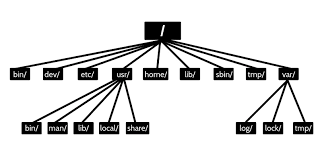

# WINDOWS

---

## 1. Instalación Linux
### 1.1 Conceptos Básicos y Distribuciones

Linux se presenta como una variante del sistema UNIX distribuido bajo licencia GPL (General Public License).

Características principales: Es un sistema multiusuario, multiproceso, multiplataforma y destaca por su estabilidad (no requiere reinicios frecuentes).

Arquitectura: Se estructura en capas que van desde el Hardware, pasando por el Kernel, Shell y Bibliotecas, hasta las Aplicaciones.

Distribuciones: Existen diversas "familias" de distribuciones como Debian/Ubuntu, Red Hat/Fedora, Arch Linux, Slackware y Android.

### 1.2 Estructura de Directorios y Dispositivos



El sistema de archivos nace de la raíz / en forma de árbol.

Dispositivos (/dev): Los dispositivos de hardware se representan como ficheros.

Disco duro SATA: /dev/sda.

CD-ROM: /dev/cdrom.

Ficheros especiales: /dev/null (descarta salidas) y /dev/zero.

### 1.3 Esquema de Particionamiento Recomendado

| Partición  | Descripcion |
| ------------- |:-------------:|
| /      | Debe contener solo lo necesario y ser simple para evitar corrupción     |
| /boot      | Partición pequeña con los kernels y ficheros de arranque     |
| /var      | Almacena logs, correos y colas de impresión. Se separa para evitar que, si se llena, desestabilice el sistema.     |
| /tmp      | Para archivos temporales; se evita copiarlo en copias de seguridad     |
| /usr      | Contiene comandos y librerías; puede configurarse como "solo lectura"     |
| /home      | Directorios de usuarios. Separarlo permite reinstalar o actualizar el sistema operativo sin perder los datos personales     |
| swap      | Memoria de intercambio. La regla sugerida es asignar el doble de la memoria RAM.     |

### 1.4 Montaje de Sistemas de Ficheros

El proceso de "montaje" asocia una partición física (ej. /dev/sdb1) a un directorio del sistema (ej. /home).

* Manual: Se realiza mediante el comando mount.
* Automático: Se configura en el fichero /etc/fstab, donde se definen el dispositivo, el punto de montaje, el tipo de sistema de archivos (ej. ext3, ext4, swap) y las opciones de arranque.

### 1.5 Arranque del Sistema (Boot)

El gestor de arranque utilizado es GRUB2, el cual es flexible y permite cargar distintos sistemas operativos.

* Proceso: BIOS/UEFI -> MBR (Etapa 1) -> Gestor de arranque (Etapa 2/Menú) -> Carga del Kernel.
* UEFI: Reemplaza a la BIOS en sistemas modernos ofreciendo mayor flexibilidad.

### 1.6 Comandos 
El documento finaliza con ejemplos prácticos de administración de discos:

Comandos de diagnóstico:
```bash
df -h // Muestra el espacio usado y disponible en los sistemas de ficheros montados.
lsblk // Lista los dispositivos de bloque y sus puntos de montaje en estructura de árbol.
```

---
## 2. Usuraios y recursos en Linux

### 2.1 Superusuario (Root) y Métodos de Acceso

El sistema distingue entre usuarios normales y el superusuario (root).

**Root**: Tiene acceso total a todos los archivos, carpetas y comandos del sistema.

>_**Riesgos**: No se recomienda entrar directamente como root porque no queda registro individual de las acciones (logs) y obliga a compartir la contraseña entre administradores._>

Comandos de acceso:

``` bash
su // "Substitute User". Permite cambiar de identidad temporalmente. Usar su - carga el entorno completo de root.

sudo // Permite a usuarios autorizados ejecutar comandos como root usando su propia contraseña. Se configura en el archivo /etc/sudoers y permite un registro detallado de quién hace qué.
```
### 2.2 Gestión de Usuarios y Contraseñas

La información de las cuentas se almacena en archivos de texto plano.

* **/etc/passwd**: Contiene información pública del usuario: nombre (username), UID (User ID), GID (Group ID), información personal, directorio home y la shell de inicio.

* **/etc/shadow**: Almacena las contraseñas cifradas y las políticas de caducidad. Es legible solo por root para evitar ataques de fuerza bruta. Utiliza "salts" (valores aleatorios) para fortalecer el cifrado.

### 2.3 Grupos de Usuarios

Permiten agrupar usuarios con intereses comunes para facilitar la gestión de recursos.

* **Archivos:** Se definen en /etc/group y sus claves en /etc/gshadow.

* **Tipos de pertenencia:** Un usuario tiene un grupo primario (definido en /etc/passwd) y puede pertenecer a múltiples grupos suplementarios.

* **Grupo Privado de Usuario (UPG):** Red Hat y otras distribuciones crean un grupo exclusivo para cada usuario nuevo por seguridad.

### 2.4 Permisos Básicos (DAC)

Linux utiliza un sistema de control de acceso discrecional (DAC) basado en tres entidades: Usuario propietario, Grupo propietario y Otros.

Tipos de permisos:

* **Lectura (r):** Ver contenido de archivo o listar un directorio.

* **Escritura (w):** Modificar archivo o crear/borrar ficheros en un directorio.

* **Ejecución (x):** Ejecutar un programa o atravesar/entrar en un directorio.

> _**Proceso de validación:** El sistema comprueba secuencialmente: ¿Es el dueño? -> Si no, ¿Es del grupo? -> Si no, aplica permisos de "otros" . Si el proceso es root (UID 0), se ignoran las restricciones._

**Herramientas:** 
  * chmod (cambiar permisos)
  * chown (cambiar dueño)
  * umask (define permisos por defecto al crear archivos).

### 2.5 Permisos Especiales

Existen permisos avanzados para casos específicos:

* **SetUID (s en usuario):** Ejecuta un programa con los privilegios del propietario del archivo, no del usuario que lo lanza (ej. comando passwd para cambiar claves siendo usuario normal).

* **SetGID (s en grupo):** 

  * En ficheros: Ejecuta con los privilegios del grupo propietario.
  * En directorios: Los archivos nuevos creados dentro heredan el grupo del directorio, no el del usuario creador. Útil para carpetas compartidas.

* **Sticky Bit (t):** Se usa en directorios como /tmp. Solo el propietario de un archivo puede borrarlo, aunque otros tengan permiso de escritura en la carpeta.

### 2.6 Listas de Control de Acceso (ACLs)

Cuando los permisos básicos (rwx para u/g/o) no son suficientes, se usan ACLs para mayor granularidad.

Permiten dar permisos a múltiples usuarios o grupos específicos en un mismo archivo.

> _**Comandos:** getfacl para ver y setfacl para modificar._

Incluye una máscara (mask) que limita los permisos máximos efectivos para usuarios y grupos secundarios.

### 2.7 Control de Acceso Obligatorio (MAC)

A diferencia del DAC (donde el usuario decide la seguridad de sus archivos), en MAC el administrador define políticas globales estrictas.

Sistemas como SELinux o AppArmor confinan a los procesos para que solo accedan a lo estrictamente necesario, protegiendo al sistema incluso si un servicio es vulnerado o ejecutado por root.

---

## 3. Notas Técnicas y Fórmulas


---

## 4. Resumen y Puntos Clave

---

